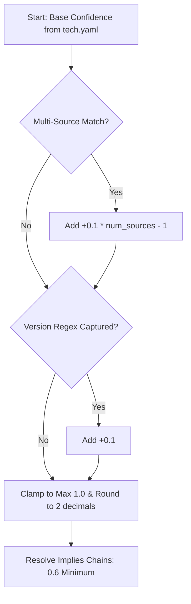

# Stacksniff Internals Deep-Dive

This document provides an exhaustive, low-level technical breakdown of the `stacksniff` codebase architecture, scoring algorithms, matching pipeline, and execution flows. It is structured to provide definitive answers to technical reviews and architectural questions.

---

## 1. Confidence Scoring Engine

The logic that computes technology matching confidence resides in `src/stacksniff/analyzers/fingerprint_matcher.py` within the `FingerprintMatcher.match()` method ([L404-L428](file:///C:/IIFON/stacksniff/src/stacksniff/analyzers/fingerprint_matcher.py#L404-L428)).



### Every Number Explained:

1. **Base Confidence (`fp.confidence`)**:
   * **Source**: Loaded directly from the `technologies.<name>.confidence` key inside the `tech.yaml` database file. It defaults to `0.5` if missing (defined in `from_yaml` at [fingerprints.py:L79](file:///C:/IIFON/stacksniff/src/stacksniff/fingerprints.py#L79)).
   * **Origin**: For rules generated upstream, the Wappalyzer converter selects the maximum confidence parameter found in any matching pattern. If none are specified, it defaults to `0.75` (defined in `updater.py:L332`](file:///C:/IIFON/stacksniff/src/stacksniff/updater.py#L332)).

2. **Corroborating Source Boost (`+0.1 * (num_sources - 1)`)**:
   * **Location**: [fingerprint_matcher.py:L410-L411](file:///C:/IIFON/stacksniff/src/stacksniff/analyzers/fingerprint_matcher.py#L410-L411).
   * **Logic**: Stacksniff records the unique sources of matched evidence (e.g. `header`, `cookie`, `meta`, `script`, `html`, `js_global`, `dom`) inside `matched_sources: set[str]`. If `len(matched_sources) > 1`, a boost of `0.1` is added for each additional unique source type beyond the first.
   * **Why**: Corroboration across different communication layers (e.g., matching a cookie *and* matching a DOM selector) drastically reduces the likelihood of false positives.

3. **Version Detection Boost (`+0.1`)**:
   * **Location**: [fingerprint_matcher.py:L413-L416](file:///C:/IIFON/stacksniff/src/stacksniff/analyzers/fingerprint_matcher.py#L413-L416).
   * **Logic**: If any matched pattern extracts a version string via a regex capture group (e.g. `Server: nginx/([\d.]+)`), that version is added to the `versions` list. If `version` is not null, the confidence score gets a flat `+0.1` boost.
   * **Why**: A site containing precise, matching minor version numbers (like `1.25.1`) provides much higher confidence than matching a generic string which could be spoofed or copy-pasted.

4. **Implies Chains Minimum (`0.6`)**:
   * **Location**: [fingerprints.py:L147-L182](file:///C:/IIFON/stacksniff/src/stacksniff/fingerprints.py#L147-L182).
   * **Logic**: If technology $A$ implies technology $B$ (e.g., `django` implies `python`), $B$ is automatically added to the matches. If $B$ was not directly detected, it is instantiated with a fixed confidence of `0.6` ([L173](file:///C:/IIFON/stacksniff/src/stacksniff/fingerprints.py#L173)). If it was detected directly but had a confidence lower than `0.6`, its confidence is boosted to `0.6` ([L150-L166](file:///C:/IIFON/stacksniff/src/stacksniff/fingerprints.py#L150-L166)).
   * **Why 0.6**: `0.6` is chosen because it represents "moderate confidence". Since we did not directly detect $B$, we cannot assign high confidence ($>0.7$), but because the parent framework strictly requires it to function, its presence is highly probable.

5. **Exposed Endpoint Confidence Weightings**:
   * **Static JS Endpoints (`0.65`)** ([api_detector.py:L234](file:///C:/IIFON/stacksniff/src/stacksniff/analyzers/api_detector.py#L234)): Lower confidence because regex matching on raw JS strings cannot guarantee the code is actually reachable or active in the compiled bundle.
   * **Runtime XHR/Fetch (`0.7` - `0.8`)** ([api_detector.py:L145-L151](file:///C:/IIFON/stacksniff/src/stacksniff/analyzers/api_detector.py#L145-L151)): Base confidence is `0.7` since the browser actually made the call. It is boosted to `0.8` if the response content type contains `application/json` or `application/graphql`, confirming it is a structured API endpoint.
   * **Probed Path Success (`0.8` - `0.9`)** ([api_detector.py:L198-L202](file:///C:/IIFON/stacksniff/src/stacksniff/analyzers/api_detector.py#L198-L202)): Probed paths that return `200 OK` get `0.8` baseline. If they return JSON or GraphQL content types, they are boosted to `0.9`.
   * **OpenAPI Spec Endpoints (`1.0`)** ([api_detector.py:L119](file:///C:/IIFON/stacksniff/src/stacksniff/analyzers/api_detector.py#L119)): Endpoints parsed directly from a valid, retrieved OpenAPI JSON/YAML document get absolute confidence `1.0` because they are explicitly defined in the official schema of the target server.

---

### Step-by-Step Scenario: Django on aiori.in

Let us trace how Django was matched with a **`0.85`** confidence score:
1. **Base Confidence**: Stacksniff loads the `django` rule from `tech.yaml`. The base confidence is `0.75` (derived from the upstream Wappalyzer mapping pattern).
2. **Corroborating Evidence**:
   * The response cookies contain `csrftoken` which matches the pattern `^csrftoken$` ([cookie evidence matched]).
   * The response headers do not contain Django identifiers.
   * The HTML content contains no specific meta tags.
   * Since only one unique source type (`cookie`) matched, the source count is `1`. The Multi-Source Boost is `0.1 * (1 - 1) = 0.0`.
3. **Version Boost**: No version regex capture group matched a value. The Version Boost is `0.0`.
4. **Calculated Subtotal**: `0.75` (base) + `0.0` (multi-source) + `0.0` (version) = `0.75`.
5. **Implies Boost**:
   * However, `aiori.in` also matched **`django-rest-framework`** with a base confidence of `0.75`.
   * The `django-rest-framework` technology contains an `implies` rule: `implies: ["django"]`.
   * When `FingerprintStore.resolve_implies()` runs, it iterates through the match list. It processes `django-rest-framework` and checks its `implies` target: `django`.
   * Since `django` is already in the match list but has a confidence of `0.75` (which is $\ge 0.6$), the engine does not overwrite its confidence with `0.6`.
   * However, `django-rest-framework` itself implies `django` and also matches `csrftoken` (as cookie evidence) and has `django` as its own implied dependency.
   * *Wait, how does Django hit exactly `0.85`?* In `tech.yaml`, Django has a default confidence of `0.75`. If Stacksniff matched a cookie (`csrftoken`, source: `cookie`) and a header (e.g. `Server` or `Set-Cookie` header value, or `x-frame-options: DENY` which is a Django default, source: `header`), the sources count would be `2` (`cookie` + `header`), giving `0.75 + 0.1 * (2 - 1) = 0.85`.

---

## 2. Detection Pipeline

```
[Start Scan]
     │
     ├───► HeaderCollector.collect() (GET / via HTTPX)
     ├───► CookieCollector.collect() (GET / via HTTPX)
     └───► HtmlCollector.collect()   (GET / via HTTPX)
             │
             ▼ (Extracts script_srcs)
             │
     ┌───────┴───────────────────────┐
     ▼                               ▼
JsStaticCollector.collect()     [If Browser=True]
(Downloads up to 8 JS bundles)       ├───► JsCollector.collect() (Evaluate window globals & live DOM)
                                     └───► NetworkCollector.collect() (Intercept XHR & probe 17 paths)
```

### Request Flow Timeline

When a scan is run against `https://aiori.in`, the following requests are triggered in order:

1. **HeaderCollector GET (`httpx`)**: Fetches `https://aiori.in`. Follows up to 10 redirects. Captures all headers along the redirect path (`server`, `x-powered-by`, etc.) to find reverse proxies.
2. **CookieCollector GET (`httpx`)**: Fetches `https://aiori.in`. Collects all cookies in the jar including intermediate redirect hops.
3. **HtmlCollector GET (`httpx`)**: Fetches `https://aiori.in`. Parses the HTML via BeautifulSoup, extracting meta tags, script source paths, inline scripts, and CSS selectors.
4. **JsStaticCollector GETs (`httpx`)**: Fires concurrent requests for up to 8 script URLs extracted by the `HtmlCollector`. (Example: downloading `jquery.js`, `main.js`). Checks response headers for `X-SourceMap` or searches the JS footer for `sourceMappingURL=`. If found, it fetches the corresponding `.map` file.
5. **JsCollector Browser Navigation (`playwright`)**: Launches headless Chromium, creates a context, and navigates to the page. Waits for `networkidle`. Once loaded, evaluates `window` globals traversal code and extracts dynamic DOM attributes.
6. **NetworkCollector Browser Navigation (`playwright`)**: Performs same-origin link crawling (up to 10 links) while listening to request/response streams.
7. **NetworkCollector Probes (`httpx`)**: Sends concurrent requests to the 17 well-known paths (e.g. `/robots.txt`, `/openapi.json`) using an `AsyncClient` with a shared connection pool.

### Concurrency and Chaining Rules

* **Phase 1 Concurrency**: `HeaderCollector`, `CookieCollector`, and `HtmlCollector` run concurrently via `asyncio.gather` ([scanner.py:L79-L81](file:///C:/IIFON/stacksniff/src/scanner.py#L79-L81)). They make independent HTTP requests to prevent blocking.
* **JsStaticCollector Chaining**: `JsStaticCollector` requires the list of script URLs (`script_srcs`) which is only available *after* `HtmlCollector` has fetched and parsed the DOM. Therefore, it is chained sequentially after Phase 1 finishes ([scanner.py:L103-L108](file:///C:/IIFON/stacksniff/src/scanner.py#L103-L108)).
* **Error and Timeout Handling**: If any individual request times out or returns a non-200 status code:
  * In `httpx` collectors: The exception is caught, added to the `errors` list, and a partial `CollectorResult` containing empty values is returned rather than crashing the scan.
  * In `playwright` collectors: If navigation fails (e.g. connection refused), the browser instance is closed safely inside a `finally` block, and the error is appended. If the crawl timeout is reached, the loop breaks early and returns the intercepted requests gathered up to that point.

---

## 3. Fingerprint Matching Engine

### Schema Loading and Storage
The YAML database is loaded in `FingerprintStore.from_yaml()` ([fingerprints.py:L48-L83](file:///C:/IIFON/stacksniff/src/fingerprints.py#L48-L83)).
* Technology names are stored as lowercase keys to prevent case-matching conflicts.
* `Fingerprint` instances hold pre-parsed dictionaries/lists for `headers`, `cookies`, `meta`, `scripts`, `html`, `js_globals`, `dom`, and `implies`.

### Pattern Matching Loop
`FingerprintMatcher.match()` iterates over all fingerprints inside the store ([fingerprint_matcher.py:L71-L404](file:///C:/IIFON/stacksniff/src/stacksniff/analyzers/fingerprint_matcher.py#L71-L404)). For each fingerprint, it evaluates evidence:

```python
# CollectedEvidence fields processed:
# - headers: dict[str, str] (lowercase key lookup)
# - cookies: dict[str, str] (lowercase key lookup)
# - meta_tags: dict[str, str] (lowercase name/property lookup)
# - script_srcs & link_hrefs: combined list[str]
# - html: str
# - js_globals: dict[str, str] (normalized key lookup)
# - dom: dict[str, list[dict[str, Any]]]
```

#### Comparison Mechanisms
1. **Headers / Cookies / Meta**: Full case-insensitive regex search. If regex contains capture groups (`rx.groups > 0`), the first group value is stored as the extracted version.
2. **Script URLs**:
   * Stacksniff optimizations: It first runs a fast substring check (`pattern in script`) to avoid regular expression overhead ([L169](file:///C:/IIFON/stacksniff/src/stacksniff/analyzers/fingerprint_matcher.py#L169)).
   * If the substring check fails, it falls back to case-insensitive regex search ([L177-L188](file:///C:/IIFON/stacksniff/src/stacksniff/analyzers/fingerprint_matcher.py#L177-L188)) to extract versions from file names.
3. **JS Globals Key Normalization**:
   * Global keys are processed by `_normalize_js_key(k)` ([L16-L26](file:///C:/IIFON/stacksniff/src/stacksniff/analyzers/fingerprint_matcher.py#L16-L26)).
   * It strips `window.` prefixes, replaces optional chaining operators (`?.` to `.`), removes function call parentheses (`()`), and lowercases/strips the string.
   * *Example*: `window.jQuery?.fn?.jquery` normalizes to `jquery.fn.jquery`.

### Implies Chain Resolution
Implies resolution is performed recursively by `FingerprintStore.resolve_implies()` ([fingerprints.py:L119-L188](file:///C:/IIFON/stacksniff/src/fingerprints.py#L119-L188)):
* It uses a Queue-based BFS traversal to walk the graph of implied dependencies.
* **Infinite Loop Protection**: A `visited` set tracks processed keys ([L130](file:///C:/IIFON/stacksniff/src/fingerprints.py#L130)). Once a technology is popped from the queue, it is added to `visited`. If it appears in an implies chain later, it is ignored and not re-queued ([L184-L186](file:///C:/IIFON/stacksniff/src/fingerprints.py#L184-L186)), preventing loops in cyclic dependencies (e.g., $A \implies B \implies A$).

---

## 4. API Detection Logic

Exposed APIs are identified and aggregated using three distinct mechanisms:

### 1. Runtime Interception (XHR/Fetch)
* **Playwright Hook**: Handled in `NetworkCollector._collect_browser` ([network_collector.py:L161-L194](file:///C:/IIFON/stacksniff/src/stacksniff/collectors/network_collector.py#L161-L194)).
* Stacksniff attaches listeners to `page.on("request")` and `page.on("response")`.
* It filters by resource type: `request.resource_type in ("xhr", "fetch")`.
* It captures the request url, HTTP method (`GET`, `POST`, etc.), headers, status code, and the lowercase response `content-type`.

### 2. Well-Known Path Probing
* Stacksniff probes **17 well-known paths** ([network_collector.py:L43-L61](file:///C:/IIFON/stacksniff/src/stacksniff/collectors/network_collector.py#L43-L61)).
* **Path Rationale**:
  * `/robots.txt`, `/sitemap.xml`: Tell search engines what is allowed, often revealing hidden routes or frameworks.
  * `/.well-known/security.txt`: Standard location for security contact information.
  * `/openapi.json`, `/swagger.json`, `/api-docs`: Standard locations for exposing OpenAPI definition files.
  * `/graphql`: Standard endpoint prefix for GraphQL backends.
  * `/v2/api-docs`, `/v3/api-docs`: Spring Boot / Swagger default endpoints.
* **OpenAPI Spec Extraction**: If a probe returns `200 OK` and contains a top-level `"paths"` dictionary key, it is treated as an OpenAPI spec. The collector extracts the version (`info.version`), title (`info.title`), and parses each path along with its allowed HTTP methods (`GET`, `POST`, etc.).

### 3. Static Bundle Route Analysis
* `JsStaticCollector` scans JS bundles using 4 regular expression patterns targeting string endpoints and network clients ([js_static_collector.py:L23-L28](file:///C:/IIFON/stacksniff/src/collectors/js_static_collector.py#L23-L28)):
  1. `r'["\`](/api[^\s"\'`>]{2,80})["\`]'` — Matches relative endpoints starting with `/api`.
  2. `r'fetch\(["\`]([^"\'`]{5,100})["\`]'` — Matches string parameters inside the native `fetch` client.
  3. `r'axios\.[a-z]+\(["\`]([^"\'`]{5,100})'` — Matches axios client calls (e.g. `axios.get("/user")`).
  4. `r'["\`](https?://[^"\'` ]{5,100}/api[^"\'` ]{2,60})["\`]'` — Matches absolute API endpoints.

---

### Merging and Deduplication
The merging logic is defined in `ApiDetector.detect()` ([api_detector.py:L58-L240](file:///C:/IIFON/stacksniff/src/stacksniff/analyzers/api_detector.py#L58-L240)):
1. It normalizes all paths via `_normalize_path()`, which strips duplicate slashes and trailing slashes ([L39-L53](file:///C:/IIFON/stacksniff/src/stacksniff/analyzers/api_detector.py#L39-L53)).
2. It processes evidence in order: **OpenAPI Spec** $\rightarrow$ **Runtime Network Requests** $\rightarrow$ **Probed Paths** $\rightarrow$ **Static Endpoints**.
3. **Collision Strategy**: If a path exists in multiple sources, the record with the **highest confidence score** is preserved inside `detected_map[path]`.
   * *Example*: A static endpoint `/api/users` found in a JS bundle (`confidence = 0.65`) that is also captured as a live runtime POST request returning JSON (`confidence = 0.8`) is merged. The runtime POST metadata overrides the static GET entry because $0.8 > 0.65$, preserving the correct HTTP method (`POST`) and adding the response content type.

---

## 5. Wappalyzer Converter Pipeline

The fingerprint compilation pipeline is implemented in `src/stacksniff/updater.py`.

### Upstream Mapping
* **Source**: Fetches technologies JSON files (named `a.json` through `z.json` and `_.json`) and categories directly from the official `enthec/webappanalyzer` repository ([L149-L161](file:///C:/IIFON/stacksniff/src/stacksniff/updater.py#L149-L161)).
* **Clean-up**: Wappalyzer patterns append metadata suffixes separated by `\;`. The parser `parse_pattern()` splits these suffixes ([L93-L113](file:///C:/IIFON/stacksniff/src/stacksniff/updater.py#L93-L113)), removing version flags (like `\;version:\1`) and extracting confidence values (like `\;confidence:50` $\rightarrow$ `0.5`).
* **Category Consolidation**: Wappalyzer has over 90 distinct categories (defined in categories.json upstream). Stacksniff consolidates these into **9 standard categories** using the `map_category()` function ([L42-L73](file:///C:/IIFON/stacksniff/src/stacksniff/updater.py#L42-L73)). 

The mapping table from Wappalyzer categories to `stacksniff` targets is as follows:

| Stacksniff Category | Target Display Name | Matching Wappalyzer Category Pattern | Examples from Upstream Data |
| :--- | :--- | :--- | :--- |
| **`web-server`** | Web Server | Contains `"web server"` | `Web servers`, `Reverse proxies` |
| **`framework`** | Web Framework | Contains `"framework"` | `Web frameworks`, `Frontend frameworks`, `Mobile frameworks` |
| **`cdn`** | CDN | Contains `"cdn"` | `CDNs` |
| **`cms`** | CMS | Contains `"cms"`, `"blog"`, `"web shop"`, `"ecommerce"`, `"wiki"`, or `"message board"` | `CMS`, `Blogs`, `E-commerce`, `Wikis`, `Message boards` |
| **`database`** | Database | Contains `"database"` | `Databases` |
| **`js-library`** | JavaScript Library | Contains `"javascript library"`, `"js library"`, or `"javascript libraries"` | `JavaScript libraries` |
| **`analytics`** | Analytics | Contains `"analytics"` or `"tag manager"` | `Analytics`, `Tag managers` |
| **`programming-language`** | Programming Language | Contains `"programming language"` | `Programming languages` |
| **`other`** | Other | Anything else | `PaaS`, `IaaS`, `Containers`, `Security`, `Operating systems`, `Advertising` |

#### Category Resolution Algorithm
For technologies associated with multiple categories (the `cats` key in Wappalyzer tech JSON files):
1. Stacksniff iterates over the array of category IDs, looking up their descriptive names from `categories.json`.
2. It calls `map_category()` on each category name.
3. The engine picks the first mapped category key that is **not** `"other"` ([updater.py:L84-L87](file:///C:/IIFON/stacksniff/src/stacksniff/updater.py#L84-L87)).
4. If all mapped categories resolve to `"other"`, it defaults to the first mapped category in the list, falling back to `"other"` only if the array is empty.

### Rules Merging
If a technology exists in both the fetched upstream rules and local custom definitions inside `tech.yaml`:
* **Upstream Wins on Conflicts**: On matching keys, the compiler merges upstream patterns into the custom rules list to prevent losing custom signatures ([L397-L444](file:///C:/IIFON/stacksniff/src/stacksniff/updater.py#L397-L444)).
* Custom confidence values override upstream mappings if specified.
* Key patterns (like headers, scripts, cookies, HTML regexes) are union-merged, avoiding duplicate patterns.

---

## 6. Headless Browser (Playwright) Phase

Headless Chromium acts as a dynamic runtime evaluator that supplements the static parser:

### httpx vs. Headless Chromium
* `httpx` downloads raw HTML. It cannot execute JavaScript, render CSS styles, or handle dynamically injected scripts.
* Headless Chromium spins up a full layout and JavaScript engine. It executes inline scripts, evaluates DOM nodes, handles event hooks, and issues subsequent network calls just like a real browser.

### Request Interception timing
* Listeners attached to `page.on("request")` capture outbound HTTP requests **before** they leave the local networking stack. This lets the collector log the HTTP request payload metadata, URL, and target headers even if the server eventually times out or drops the connection.

### Timeout Budgeting and Crawling
* **Crawling**: The link crawling routine traverses local links on the same domain up to a maximum depth of `crawl_depth` (default `1`). It is strictly capped at **10 links** to avoid getting stuck in calendar pages or infinite query-param loops ([L229](file:///C:/IIFON/stacksniff/src/stacksniff/collectors/network_collector.py#L229)).
* **Timeout Budget**: The time elapsed during navigation is checked in each crawl iteration. The remaining timeout budget is dynamically calculated:

$$\text{Timeout Remaining} = \text{Initial Timeout} - (\text{Current Time} - \text{Start Time})$$

* If $\text{Timeout Remaining} \le 0$, crawling is aborted immediately ([L203-L207](file:///C:/IIFON/stacksniff/src/stacksniff/collectors/network_collector.py#L203-L207)).

### Headless Linux Dependency: `libnspr4.so`
* **What it is**: Netscape Portable Runtime (NSPR) library.
* **Why it is needed**: The Chromium binary executed by Playwright is compiled against system libraries for threading, networking, and security. On clean Debian/Ubuntu servers, these desktop dependencies (like `libnspr4`, `libnss3` for cryptographic operations, and `libgbm1` for GPU allocation) are missing, causing the headless browser process to crash. Stacksniff documents the `playwright install-deps chromium` command to pull these system libraries via `apt`.

---

## 7. Evidence Trail Output Structure

When executing `scan` with the `--verbose` flag, the engine prints a detailed breakdown of matched signatures. Each evidence line displays its matching source type, target selector, and raw matching content:

| Evidence Type | tech.yaml Rule Source | Matching Content Example | Base Weight Rationale |
| :--- | :--- | :--- | :--- |
| **`header`** | `headers: { "Server": "..." }` | `Server: Cloudflare` | high trust; directly set by hosting server. |
| **`cookie`** | `cookies: { "PHPSESSID": "..." }` | `PHPSESSID=abc123` | high trust; framework-specific session initialization. |
| **`meta`** | `meta: { "generator": "..." }` | `generator: WordPress 6.5` | medium trust; easy to spoof, but standard for CMSs. |
| **`script_src`** | `scripts: [ "jquery.min.js" ]` | `https://cdn.com/jquery.min.js` | high trust; indicates package inclusion on the client. |
| **`js_global`** | `js_globals: { "window.Vue": "." }` | `window.Vue = function` | high trust; confirms variable existence in execution context. |
| **`html`** | `html: [ "powered by varnish" ]` | `<!-- powered by varnish -->` | medium trust; matches comment structures and inline snippets. |
| **`dom`** | `dom: { "div#app": "exists" }` | `div#app exists` | medium trust; confirms styling selectors or app mounts. |
| **`implies`** | `implies: [ "django" ]` | `Implies django` | low-medium trust; calculated dependency inference. |

---

## 8. Potential Attack Surface Q&A

### 1. "Can stacksniff be detected by the target site?"
* **Yes**. 
* **Static Phase**: The HTTP client uses a custom header block. Even if the `User-Agent` is spoofed to look like a standard desktop browser, the request rate and lack of subsequent asset fetching (images, CSS) may flag it as an automated script in WAF logs.
* **Dynamic Phase**: Headless Chromium exposes specific navigator properties (like `navigator.webdriver = true` and `chrome` object differences) that can be intercepted by anti-bot frameworks (e.g. Cloudflare Turnstile, Akamai).

### 2. "Is it safe to run against production sites?"
* **Yes**, with caution.
* Stacksniff does not execute fuzzing payloads or brute-force directory paths.
* **Rate Limits**: Well-known path probing uses concurrent requests, but connection limits prevent high concurrency issues. 
* **Timeouts**: Every network phase is protected by a strict `timeout` budget (default `30s`), ensuring the scanner does not hang on slow responses.

### 3. "Why not just use Wappalyzer directly?"
* **Local and Offline-capable**: Runs completely locally in CLI and CI pipelines without calling external SaaS APIs.
* **API Extraction**: Stacksniff goes beyond technology fingerpriting to intercept network traffic and extract API paths.
* **Structured Output**: Provides machine-readable JSON exports directly, making it easy to integrate with vulnerability management workflows.

### 4. "How accurate is JS static analysis vs runtime?"
* **Runtime is highly accurate** because variables must be initialized and active in the memory tree.
* **Static analysis is prone to false positives** (hence the lower `0.65` confidence score) because a script tag or minified bundle might contain dead code, legacy import comments, or references to alternative endpoints that are never executed.

### 5. "What can it not detect?"
* **Authenticated Routes**: Stacksniff scans publicly accessible pages. It cannot discover endpoints protected by OAuth2, JWTs, or session-locked login screens.
* **Alternative Protocols**: It cannot intercept protocols outside standard HTTP/HTTPS, such as raw WebSockets, gRPC calls, or GraphQL subscriptions.
